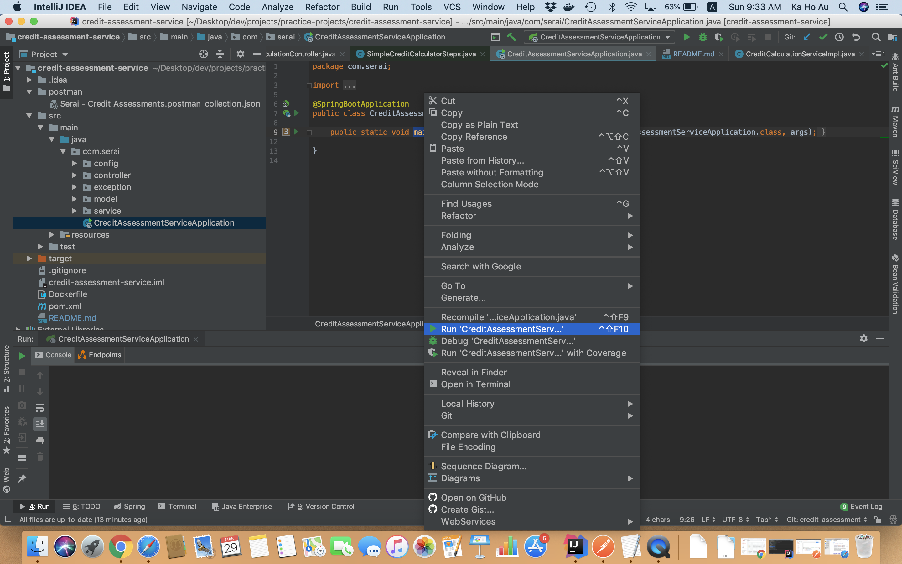
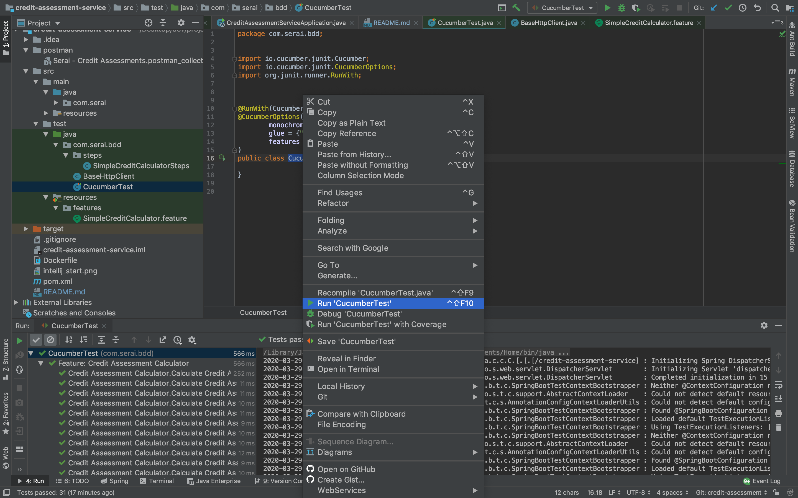

### Configuration

-- The Attribute, Category and Score mappings are configurable in application.yml

### Assumption

-- The Number of employees and score mapping is adjusted. The original mapping has overlaps... 
   e.g. When number of employees = 15, it can either be scored 32 or 55... Therefore it is adjusted as follows:

    1 to 5      0
    6 to 10     20
    11 to 15    32
    16 to 20    55
    21+         70

-- Due to limited project scope, the program assumes user's input is correct (this is assumed in the given Gherkins feature file with one scenario outline). The file should cover the edge cases and normal cases to test out the program.  
-- In case the endpoint receives invalid input (e.g. wrong company type, negative number), the program will still be able to handle it gracefully with the global exception handling

### Running the server locally

If using IntelliJ IDEA, **Lombok plugin** should be installed through Preferences->Plugins to prevent error highlight.
Then the application can run as follows:

Additionally, The jar can be built and run via command line

    mvn clean install -Dmaven.test.skip=true
    java -jar ./target/credit-assessment-service.jar

### Server Generation

1. Type `mvn clean install` to build the application
2. Type `docker build --tag credit-assessment-service -f ./Dockerfile .` to build the Docker image
3. Type `docker run -d -p 8080:8080 credit-assessment-service` to run the server docker image

### Running cucumber test

In Intellij IDEA, the cucumber test can be started here

## Swagger

1. swagger in UI
http://localhost:8080/credit-assessment-service/swagger-ui.html

2. Json file of the whole swagger to be used in the corresponding spec repo
http://localhost:8080/credit-assessment-service/v2/api-docs

## Postman

The postman script is included under the postman folder for reference
